  

# Rags-To-Riches-Secrets

A country builds substantial wealth by ensuring more money flows **into its economy than out of it**. 

Here is how those 5 economic drivers function to make a country rich:

### 1. Net Tourism Surplus
A net tourism surplus occurs when **foreign travelers spend more money inside a country** than the country's own residents spend abroad. 
* **Wealth Impact:** International tourists bring foreign currency directly into the local economy. This cash instantly boosts local businesses, hospitality, and entertainment sectors while creating immediate jobs.

| Country | Inbound Receipts ($) | Outbound Spending ($) | Net Tourism Balance ($) | Balance as % of GDP | Share of Global Tourism Receipts (%) |
| :--- | :--- | :--- | :--- | :--- | :--- |
| **USA** | ~$215 Billion | ~$185 Billion | **+$30 Billion** (Surplus) | +0.11% of GDP | ~14.3% |
| **China** | ~$35 Billion | ~$195 Billion | **-$160 Billion** (Deficit) | -0.89% of GDP | ~2.3% |
| **India** | ~$35 Billion | ~$28 Billion | **+$7 Billion** (Surplus) | +0.18% of GDP | ~2.3% |

---

### 2. Net Trade Surplus
A net trade surplus means a country's **total exports of goods and services exceed its total imports**. 
* **Wealth Impact:** When global consumers buy a nation's cars, tech, or agricultural goods, money pours into the exporting country. This creates a massive accumulation of foreign exchange reserves and strengthens the local currency.

| Country | Total Exports (Goods & Services) | Total Imports (Goods & Services) | Net Trade Balance ($) | Net Trade Balance as % of GDP | Share of Global Exports (%) |
| :--- | :--- | :--- | :--- | :--- | :--- |
| **USA** | ~$3.05 Trillion | ~$3.85 Trillion | **-$800 Billion** (Deficit) | -2.83% of GDP | ~9.8% |
| **China** | ~$3.51 Trillion | ~$2.92 Trillion | **+$590 Billion** (Surplus) | +3.28% of GDP | ~14.2% |
| **India** | ~$778 Billion | ~$854 Billion | **-$76 Billion** (Deficit) | -1.95% of GDP | ~2.5% |

---

### 3. Net Foreign Direct Investment (FDI) Surplus
An FDI surplus happens when **foreign companies invest more capital into a country's businesses and infrastructure** than domestic companies invest abroad. 
* **Wealth Impact:** Global corporations build factories, set up offices, and fund local tech infrastructure. This creates high-skilled jobs, permanently upgrades local industry, and transfers valuable global expertise to the local workforce.

| Country | Inward FDI Flow ($) | Outward FDI Flow ($) | Net FDI Balance ($) | Inward FDI as % of GDP | Share of Global Inward FDI (%) |
| :--- | :--- | :--- | :--- | :--- | :--- |
| **USA** | ~$310 Billion | ~$265 Billion | **+$45 Billion** (Surplus) | 1.10% of GDP | ~23.5% |
| **China** | ~$33 Billion | ~$148 Billion | **-$115 Billion** (Deficit / Outward net) | 0.18% of GDP | ~2.5% |
| **India** | ~$71 Billion | ~$14 Billion | **+$57 Billion** (Surplus) | 1.82% of GDP | ~5.4% |

---

### 4. Net Remittance Surplus
A net remittance surplus occurs when **citizens working abroad send more money back home** to their families than foreign workers inside the country send out.
* **Wealth Impact:** This money goes directly into the hands of citizens, bypassing corporate overhead. Families use it to buy homes, pay for education, and start small businesses, which drastically increases domestic consumer spending and drives economic growth.

| Country | Remittance Inflows ($) | Remittance Outflows ($) | Net Remittance Balance ($) | Inflows as % of GDP | Share of Global Remittance Inflows (%) |
| :--- | :--- | :--- | :--- | :--- | :--- |
| **USA** | ~$7 Billion | ~$79 Billion | **-$72 Billion** (Deficit) | 0.02% of GDP | ~0.8% |
| **China** | ~$49 Billion | ~$15 Billion | **+$34 Billion** (Surplus) | 0.27% of GDP | ~5.3% |
| **India** | ~$129 Billion | ~$8 Billion | **+$121 Billion** (Surplus) | 3.31% of GDP | ~14.3% |

---

### 5. High-Skilled Reverse Migration (NRIs Returning)
Often called "reverse brain drain," this happens when **highly educated citizens or members of the diaspora return home** to live and work.
* **Wealth Impact:** Returning citizens bring back world-class expertise, international networks, and significant savings. They frequently found high-tech startups, introduce advanced business practices, and drive domestic innovation, converting foreign experience into national economic power.

| Country | Annual Returning Skilled Professionals (Est.) | Skilled Returnees with Foreign Degrees/STEM (%) | Est. Injected Capital / Wealth Repatriated ($) | Repatriated Capital as % of GDP | Global Context & Migration Dynamic |
| :--- | :--- | :--- | :--- | :--- | :--- |
| **USA** | ~25,000 – 35,000 returning citizens | ~65% STEM / Advanced degrees | ~$15 Billion | ~0.05% of GDP | Primary destination facing net skilled outflow / visa bottlenecks (~51%–76% international grads depart) |
| **China** | ~600,000+ ("Haigui" Sea Turtles) | ~82% Postgrad / STEM & Tech | ~$45 Billion | ~0.25% of GDP | Massive return wave driven by national talent programs ("Thousand Talents") and tech scale |
| **India** | ~75,000 – 100,000 returning NRIs | ~78% Tech, AI, & Management | ~$22 Billion | ~0.56% of GDP | Rapidly accelerating due to GCC (Global Capability Centres) expansion & U.S. H-1B bottlenecks |

